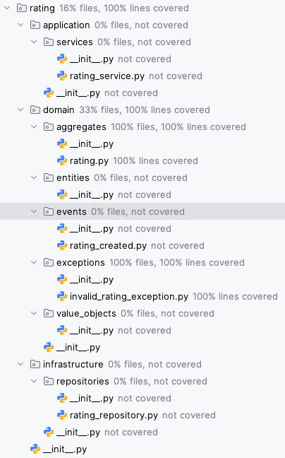

# ChargeHub Berlin

## Project Overview

ChargeHub Berlin is an interactive and user-friendly platform designed to support Berliners in navigating and improving the local electric vehicle (EV) charging infrastructure. By leveraging crowdsourcing, it empowers users to locate, evaluate, and enhance charging stations in their area.

In the following diagram, we present the use cases that ChargeHub Berlin will support. These use cases are designed to provide a comprehensive overview of the platform's functionality and user interactions. Our group selected the two use cases highlighted in red as the primary focus of our project.

1. **Find Charging Stations**: Users can search for charging stations in Berlin by entering a postal code. The platform will display a map with the location of the charging stations, along with additional information such as the charging type and availability.
2. **Rating Charging Stations**: Users can rate charging stations in Berlin based on their personal experiences. This feature allows users to share feedback and recommendations with the community, helping others make informed decisions about where to charge their EVs.

For the implementation we used the following technologies:

- **Communication**: Google Meet, WhatsApp, GitHub
- **IDE**: PyCharm Professional
- **Programming Languages**: Python
- **Libraries**: pytest, streamlit
- **Modeling**: visual-paradigm.com, miro.com

## Project Development Documentation

### 1. Domain Modeling and Event Structure

We first created the domain event flow diagram to visualize the interactions between the different components of the system. This diagram helped us identify the key events and data flows that would be essential for the platform's functionality.

