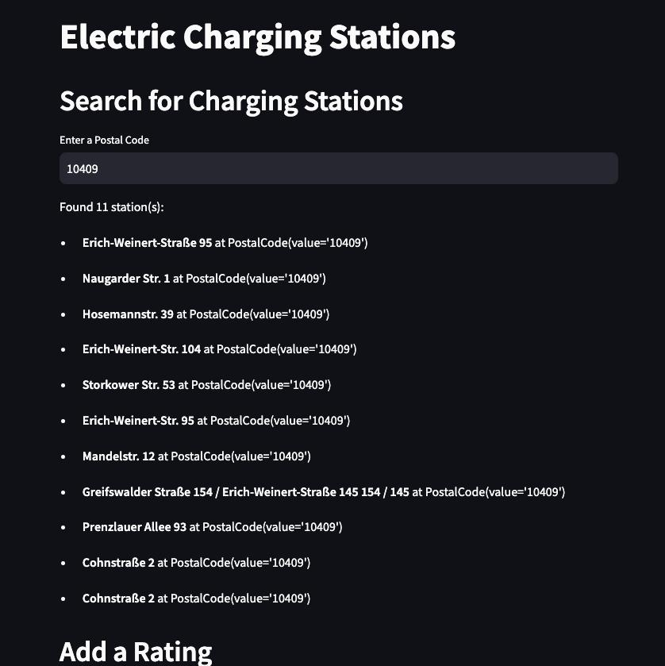

# Charge Hub Berlin | Group 11

Janik Tilgner - 916531

Muhammad Ahsan - 105997

Nahid Taherkhani - 106597

Urwa Maqsood - 106425


## Project Overview

ChargeHub Berlin is an interactive and user-friendly platform designed to support Berliners in navigating and improving the local electric vehicle (EV) charging infrastructure. By leveraging crowdsourcing, it empowers users to locate, evaluate, and enhance charging stations in their area.

In the following diagram, we present the use cases that ChargeHub Berlin will support. These use cases are designed to provide a comprehensive overview of the platform's functionality and user interactions. Our group selected the two use cases highlighted in red as the primary focus of our project.

1. **Find Charging Stations**: Users can search for charging stations in Berlin by entering a postal code. The platform will display a map with the location of the charging stations, along with additional information such as the charging type and availability.
   
2. **Rating Charging Stations**: Users can rate charging stations in Berlin based on their personal experiences. This feature allows users to share feedback and recommendations with the community, helping others make informed decisions about where to charge their EVs.


For the implementation we used the following technologies:

- **Communication**: Google Meet, WhatsApp, GitHub
- **Framework**: Streamlit for rapid UI development and integration with Python
- **Programming Languages**: Python
- **IDE**: PyCharm Professional
- **Frontend**: Streamlit widgets for forms and interactions; minimal HTML/CSS and Bootstrap for styling
- **Libraries**: pytest, streamlit
- **Deployment**: Local testing with Streamlit, scalable to cloud platforms like Streamlit Cloud
- **Modeling**: Pandas and NumPy for data processing, visual-paradigm.com, miro.com

## Project Development Documentation

The general project structure is inspired by the Clean Architecture and Domain-Driven Design (DDD) principles. So for each module (bounded context) we have a separate folder in the project structure. The main modules are `charging`, `rating` and `shared_kernel`. Each module is then (inspired by CA or Onion Architecture) divided into `application`, `domain` and `infrastructure`. The `shared_kernel` module contains shared entities and value objects that are used across different modules.

An example of the project structure is shown below (charging module):


### 1. Domain Modeling and Event Structure

We first created the domain event flow diagram to visualize the interactions between the different components of the system. This diagram helped us identify the key events and data flows that would be essential for the platform's functionality.

#### 1. Search Charging Stations


#### 2. Rate Charging Stations


### 2. Test-Driven Development (TDD)


We began by writing tests for the core functionalities of the platform, we identified the key components that needed to be tested and created test cases for each one. Each team member was responsible for writing tests for a specific component e.g. `charging` or `rating` module. Sometimes it happened that we implemented the tests after the implementation of the code, but we always made sure that the tests were written before the code was merged into the main branch.

For our test coverage, we used the `pytest` library to run the tests and generate a coverage report. We aimed to achieve a test coverage of at least 80% for each module. Since we were working with PyCharm Professional, we were able to run the tests directly from the IDE and get a direct feedback on the current test coverage. (see screenshot of the file structure and the coverage behind it)

We used for the backend a small SQLite database to store the charging stations and the ratings. The logic for storing and loading the entities happens in the `repository` module. The `repository` module is responsible for the communication with the database and the data handling.

The UI will be implemented with the `streamlit` library. We will cerate a simple interface that allows users to search for charging stations and rate them. The UI is currently not fully developed.

## 3. Integration of explored datasets

We cleaned the dataset with the `pandas` library and then moved it into the SQLite database. The dataset contains information about the charging stations in Berlin. There were some minor issues with the dataset, such as missing values or incorrect data types, which we fixed during the cleaning process.

Before we implemented our specific modules we made sure our desired implementation is coordinated with the DDD Principles.

## 4. LLM-Integration

We used LLM while coding in the form of GitHub Copilot and ChatGPT. GitHub Copilot helped us with code suggestions and completions, while ChatGPT was used for generating documentation and comments. We found both tools to be very helpful in improving our productivity and code quality. Mostly they were used for boilerplate code and testing (see example below).

```python
def is_valid_postal_code(value: str):
    assert PostalCode(value).value == value


def is_invalid_postal_code(value: str):
    with pytest.raises(InvalidPostalCodeException):
        PostalCode(value)


@pytest.mark.parametrize("value", ["12345", "54321", "00000", "99999"])
def test_valid_postal_code(value: str):
    """Test valid postal code"""
    is_valid_postal_code(value)


@pytest.mark.parametrize("value", ["12A45", "5432", "0000", "999999"])
def test_invalid_postal_code(value: str):
    """Test invalid postal code"""
    is_invalid_postal_code(value)
```

## 5. Backend-Architrcture
The backend architecture is built using Python and Streamlit, providing core services for searching charging stations, submitting ratings, and generating reports. Data is processed in-memory for simplicity, with the flexibility to integrate SQLite for persistent storage in the future.

## 6. UI Implementation

The UI for the Electric Charging Stations project was designed to enhance user interaction, focusing on features like searching for charging stations by postal code and adding ratings to stations. The UI consists of three main sections: searching, rating, and reporting. It uses Streamlit widgets for user-friendly interaction and a clean, responsive design. 

**Search Charging Stations (Search CS) Use Case**: The "Search Charging Stations" feature allows users to locate nearby stations by entering a location (e.g., city or ZIP code) and selecting a station type (fast or normal charging). The system processes these inputs, queries the database, and displays matching results, including station details like name, location, and type. This functionality ensures user convenience and highlights the system's ability to deliver accurate, location-based results efficiently.

**Add a Rating**: Users can rate charging stations on a scale of 1 to 5, encouraging user feedback and improving service quality.





# Technical Improvements
**Streamlit Integration**: Simplified UI creation and testing.

**Backend Updates**: Added missing functionality to handle user ratings, ensuring modular and clean code structure.

    
# Technical challenges

## Challenge 1: Data Cleaning and Integration

One of the main challenges we faced was cleaning and integrating the datasets. The datasets contained a lot of missing values, incorrect data types, and inconsistencies that needed to be addressed before we could use them in our platform. We used the `pandas` library to clean the datasets and then moved them into a SQLite database for further processing.

## Challenge 2: Test-Driven Development

Another challenge was implementing the platform using a test-driven development approach. While writing tests before the code helped us identify potential issues early on, it also required a lot of coordination and communication between team members to ensure that the tests were written correctly and covered all the necessary functionalities. 

Often we had to think deeply about what and how our code should be implemented. This was a challenge because we had to think about the implementation before we actually implemented it.

# Project Conclusion

The "ChargeHub Berlin" project successfully developed a user-friendly system for managing electric charging stations by integrating domain-driven design (DDD), test-driven development (TDD), and user-focused modeling.

Key features such as searching stations, submitting ratings, and generating reports were implemented with a modular backend and an intuitive UI. SQLite was used for data storage, ensuring consistency and reliability. Real-world datasets were integrated to validate system accuracy and functionality.

The project highlights how systematic engineering practices and innovative tools can deliver scalable, reliable, and practical solutions tailored to user needs.
